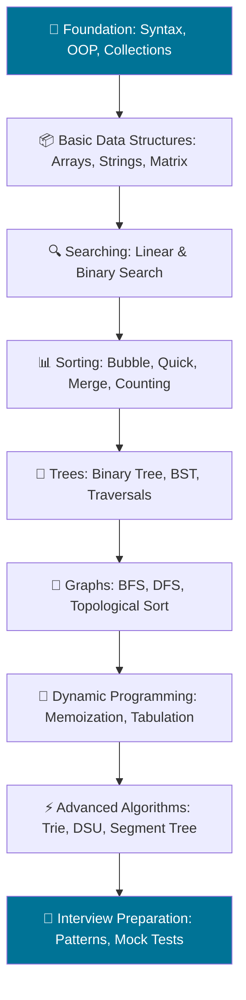

<p align="center">
  
</p>

<p align="center">
  <code>A curated collection of Java Data Structures & Algorithms solutions — clean, optimized, and interview-ready.</code>
</p>

<p align="center">
  
  
  
  
</p>

---

## About

This repository is a structured collection of **Data Structures & Algorithms** solutions written in **Java**. Each solution is designed to be **clean**, **efficient**, and **easy to understand** — making it ideal for interview preparation, skill building, and open source collaboration.

**What you'll find here:**
- Topic-wise DSA solutions in Java, organized by data structure and algorithm pattern
- Optimized time and space complexity with analysis for each solution
- Consistent coding style following industry-standard Java conventions
- Patterns and techniques commonly asked in technical interviews at top tech companies
- Regular daily practice with incremental difficulty progression
- Clean, self-documenting code with meaningful identifiers and minimal comments

**Why this exists:**
Preparing for software engineering interviews requires structured, deliberate practice. This repository serves as a personal knowledge base and a shareable portfolio demonstrating problem-solving ability, coding discipline, and a commitment to continuous learning.

---

## Features

- **Java Solutions** — All code written in Java 17+
- **Clean Code** — Readable, well-structured, consistent formatting
- **Optimized Algorithms** — Focus on best time & space complexity
- **Interview Preparation** — Covers top patterns asked by FAANG & product-based companies
- **Pattern-Based Learning** — Grouped by algorithmic patterns
- **Daily Practice** — Regular contributions to maintain consistency
- **Well Organized** — Topic-wise folder structure for easy navigation
- **Easy Navigation** — Clear naming and directory layout
- **Time & Space Analysis** — Every solution includes complexity analysis
- **Interview Focused** — Problems selected from LeetCode, GeeksforGeeks, and real interview experiences

---

## Dashboard

<p align="center">
  
  
  
  
  
  
  
  
  
  
</p>

---

## Topics Covered

| Topic | Description | Difficulty | Status |
|-------|-------------|------------|--------|
| [Arrays](https://github.com/kartik00052/code0052/tree/main/Arrays) | Sorting, searching, subarrays, two-pointer | ⬜ | ❌ Not Started |
| [Strings](https://github.com/kartik00052/code0052/tree/main/Strings) | Pattern matching, manipulation, anagrams | ⬜ | ❌ Not Started |
| [Linked Lists](https://github.com/kartik00052/code0052/tree/main/LinkedList) | Singly, doubly, cycle detection, merge | ⬜ | ❌ Not Started |
| [Stacks](https://github.com/kartik00052/code0052/tree/main/Stack) | Monotonic stack, expression evaluation | ⬜ | ❌ Not Started |
| [Queues](https://github.com/kartik00052/code0052/tree/main/Queue) | BFS, priority queue, deque | ⬜ | ❌ Not Started |
| [Trees](https://github.com/kartik00052/code0052/tree/main/Tree) | Traversals, BST, LCA, diameter | ⬜ | ❌ Not Started |
| [Binary Search Trees](https://github.com/kartik00052/code0052/tree/main/BST) | Insert, delete, search, validation | ⬜ | ❌ Not Started |
| [Heaps](https://github.com/kartik00052/code0052/tree/main/Heap) | Min-heap, max-heap, heap sort | ⬜ | ❌ Not Started |
| [HashMap](https://github.com/kartik00052/code0052/tree/main/HashMap) | Frequency, caching, two-sum variants | ⬜ | ❌ Not Started |
| [HashSet](https://github.com/kartik00052/code0052/tree/main/HashSet) | Duplicates, intersection, union | ⬜ | ❌ Not Started |
| [Graphs](https://github.com/kartik00052/code0052/tree/main/Graph) | BFS, DFS, Dijkstra, topological sort | ⬜ | ❌ Not Started |
| [Dynamic Programming](https://github.com/kartik00052/code0052/tree/main/DynamicProgramming) | Knapsack, LCS, LIS, DP on grids | ⬜ | ❌ Not Started |
| [Greedy](https://github.com/kartik00052/code0052/tree/main/Greedy) | Activity selection, coin change, intervals | ⬜ | ❌ Not Started |
| [Recursion](https://github.com/kartik00052/code0052/tree/main/Recursion) | Subsets, permutations, combinations | ⬜ | ❌ Not Started |
| [Backtracking](https://github.com/kartik00052/code0052/tree/main/Backtracking) | N-Queens, Sudoku, maze problems | ⬜ | ❌ Not Started |
| [Binary Search](https://github.com/kartik00052/code0052/tree/main/BinarySearch) | Classic, rotated array, search space | ⬜ | ❌ Not Started |
| [Sliding Window](https://github.com/kartik00052/code0052/tree/main/SlidingWindow) | Fixed & variable window problems | ⬜ | ❌ Not Started |
| [Two Pointers](https://github.com/kartik00052/code0052/tree/main/TwoPointers) | Pair sum, triplet, partitioning | ⬜ | ❌ Not Started |
| [Prefix Sum](https://github.com/kartik00052/code0052/tree/main/PrefixSum) | Range queries, subarray sum | ⬜ | ❌ Not Started |
| [Bit Manipulation](https://github.com/kartik00052/code0052/tree/main/BitManipulation) | XOR tricks, bit masking, counting bits | ⬜ | ❌ Not Started |
| [Math](https://github.com/kartik00052/code0052/tree/main/Math) | Number theory, prime, gcd, combinatorics | 🟢 | ✅ In Progress |
| [Sorting](https://github.com/kartik00052/code0052/tree/main/Sorting) | Quick sort, merge sort, counting sort | ⬜ | ❌ Not Started |
| [Searching](https://github.com/kartik00052/code0052/tree/main/Searching) | Linear, binary, ternary search | ⬜ | ❌ Not Started |
| [Matrix](https://github.com/kartik00052/code0052/tree/main/Matrix) | Spiral, rotate, set zero, search 2D | ⬜ | ❌ Not Started |
| [Trie](https://github.com/kartik00052/code0052/tree/main/Trie) | Insert, search, prefix, autocomplete | ⬜ | ❌ Not Started |
| [Disjoint Set Union](https://github.com/kartik00052/code0052/tree/main/DSU) | Union-find, connected components | ⬜ | ❌ Not Started |
| [Segment Tree](https://github.com/kartik00052/code0052/tree/main/SegmentTree) | Range queries, point updates | ⬜ | ❌ Not Started |
| [Fenwick Tree](https://github.com/kartik00052/code0052/tree/main/FenwickTree) | Prefix sum, BIT operations | ⬜ | ❌ Not Started |
| [Priority Queue](https://github.com/kartik00052/code0052/tree/main/PriorityQueue) | Top K, median, merge K sorted | ⬜ | ❌ Not Started |
| [Deque](https://github.com/kartik00052/code0052/tree/main/Deque) | Sliding window max, palindrome check | ⬜ | ❌ Not Started |
| [Intervals](https://github.com/kartik00052/code0052/tree/main/Intervals) | Merge, insert, overlap, meeting rooms | ⬜ | ❌ Not Started |
| [Monotonic Stack](https://github.com/kartik00052/code0052/tree/main/MonotonicStack) | Next greater, largest rectangle | ⬜ | ❌ Not Started |
| [Monotonic Queue](https://github.com/kartik00052/code0052/tree/main/MonotonicQueue) | Sliding window max/min | ⬜ | ❌ Not Started |

---

## Repository Structure

```
Code0052/
├── Arrays/
├── Strings/
├── LinkedList/
├── Stack/
├── Queue/
├── Tree/
├── BST/
├── Heap/
├── HashMap/
├── HashSet/
├── Graph/
├── DynamicProgramming/
├── Greedy/
├── Recursion/
├── Backtracking/
├── BinarySearch/
├── SlidingWindow/
├── TwoPointers/
├── PrefixSum/
├── BitManipulation/
├── Math/
├── Sorting/
├── Searching/
├── Matrix/
├── Trie/
├── DSU/
├── SegmentTree/
├── FenwickTree/
├── PriorityQueue/
├── Deque/
├── Intervals/
├── MonotonicStack/
├── MonotonicQueue/
├── CONTRIBUTING.md
├── ROADMAP.md
├── LICENSE
└── README.md
```

---

## Learning Roadmap



---

## Progress Tracker

Track your DSA journey. Mark `[x]` for completed topics.

- [ ] **Arrays** — Sorting, searching, subarrays, two-pointer
- [ ] **Strings** — Pattern matching, manipulation, anagrams
- [ ] **Linked Lists** — Singly, doubly, cycle detection, merge
- [ ] **Trees** — Traversals, BST, LCA, diameter
- [ ] **Graphs** — BFS, DFS, Dijkstra, topological sort
- [ ] **Dynamic Programming** — Knapsack, LCS, LIS, DP on grids
- [ ] **Greedy** — Activity selection, coin change, intervals
- [ ] **Backtracking** — N-Queens, Sudoku, maze problems
- [ ] **Sliding Window** — Fixed & variable window problems
- [ ] **Two Pointers** — Pair sum, triplet, partitioning
- [ ] **Bit Manipulation** — XOR tricks, bit masking, counting bits
- [ ] **Math** — Number theory, prime, gcd, combinatorics
- [ ] **Binary Search** — Classic, rotated array, search space
- [ ] **Recursion** — Subsets, permutations, combinations
- [ ] **Stacks & Queues** — Monotonic stack, BFS, deque
- [ ] **Heaps & Priority Queues** — Top K, median, heap sort
- [ ] **Trie** — Insert, search, prefix, autocomplete
- [ ] **Disjoint Set Union** — Union-find, connected components
- [ ] **Segment Tree** — Range queries, point updates
- [ ] **Fenwick Tree** — Prefix sum, BIT operations

---

## Featured Problem Patterns

| Pattern | Description |
|---------|-------------|
| **Sliding Window** | Efficient subarray/substring problems using expanding and shrinking windows |
| **Binary Search** | Divide and conquer on sorted data and search spaces |
| **Fast & Slow Pointer** | Cycle detection, middle element, and linked list problems |
| **Two Pointer** | Pair/triplet sums, partitioning, and comparison problems |
| **DFS** | Depth-first traversal for trees, graphs, and backtracking |
| **BFS** | Level-order traversal, shortest path in unweighted graphs |
| **Union Find** | Dynamic connectivity, cycle detection in undirected graphs |
| **Topological Sort** | Dependency resolution, scheduling problems |
| **Kadane's Algorithm** | Maximum subarray sum in O(n) |
| **Prefix Sum** | Range sum queries, subarray sum problems |
| **Monotonic Stack** | Next greater element, largest rectangle in histogram |
| **Backtracking** | Generate all solutions — permutations, subsets, combinations |
| **Memoization** | Top-down DP for overlapping subproblems |

---

## Current Repository Status

This repository is in active development. New solutions are added regularly as part of daily practice. The current focus is building out the **Math** and **Recursion** sections before expanding into other topics. Each solution includes the problem description, approach explanation, and complexity analysis within the code comments.

---

## Coding Standards

Every solution in this repository follows these principles:

| Standard | Description |
|----------|-------------|
| **Meaningful Names** | Variables and methods have descriptive, intention-revealing names |
| **Minimal Comments** | Code is self-documenting; comments used only for complex logic |
| **Optimized Complexity** | Solutions aim for the best achievable time & space complexity |
| **Consistent Formatting** | Indentation, braces, and spacing follow Java conventions |
| **Readable Code** | Small methods, single responsibility, no deep nesting |
| **Reusable Functions** | Utility methods extracted for common operations |

---

## Time & Space Complexity Reference

| Topic | Best Case | Average Case | Worst Case | Space |
|-------|-----------|--------------|------------|-------|
| **Linear Search** | O(1) | O(n) | O(n) | O(1) |
| **Binary Search** | O(1) | O(log n) | O(log n) | O(1) |
| **Bubble Sort** | O(n) | O(n²) | O(n²) | O(1) |
| **Quick Sort** | O(n log n) | O(n log n) | O(n²) | O(log n) |
| **Merge Sort** | O(n log n) | O(n log n) | O(n log n) | O(n) |
| **Heap Sort** | O(n log n) | O(n log n) | O(n log n) | O(1) |
| **BFS / DFS (Graph)** | O(V + E) | O(V + E) | O(V + E) | O(V) |
| **Dijkstra** | O(V log V) | O((V + E) log V) | O((V + E) log V) | O(V) |
| **Knapsack (DP)** | O(nW) | O(nW) | O(nW) | O(nW) |
| **LCS (DP)** | O(mn) | O(mn) | O(mn) | O(mn) |

---

## How to Run

**Prerequisites:** Java 17+ installed on your system.

```bash
# Clone the repository
git clone https://github.com/kartik00052/code0052.git

# Navigate to a topic directory
cd code0052/Arrays

# Compile a Java file
javac Solution.java

# Run the compiled class
java Solution
```

> All solutions are compatible with standard Java compilers. No external dependencies required.

---

## Contributing

Contributions are welcome! If you'd like to improve an existing solution or add a new one:

```bash
# 1. Fork the repository
# 2. Clone your fork
git clone https://github.com/your-username/code0052.git

# 3. Create a new branch
git checkout -b feature/your-feature-name

# 4. Make your changes and commit
git add .
git commit -m "Add: optimized solution for Two Sum"

# 5. Push and open a Pull Request
git push origin feature/your-feature-name
```

**Contribution guidelines:**
- Follow the existing coding style and naming conventions
- Add time & space complexity in comments
- Keep solutions focused and single-purpose
- Ensure the code compiles and runs before submitting

---

## Learning Resources

| Resource | Link |
|----------|------|
| Oracle Java Documentation | [docs.oracle.com/javase](https://docs.oracle.com/javase/tutorial/) |
| LeetCode | [leetcode.com](https://leetcode.com/) |
| GeeksforGeeks | [geeksforgeeks.org](https://www.geeksforgeeks.org/) |
| NeetCode | [neetcode.io](https://neetcode.io/) |
| Codeforces | [codeforces.com](https://codeforces.com/) |
| AtCoder | [atcoder.jp](https://atcoder.jp/) |
| HackerRank | [hackerrank.com](https://www.hackerrank.com/) |
| InterviewBit | [interviewbit.com](https://www.interviewbit.com/) |
| Java Tutorials (W3Schools) | [w3schools.com/java](https://www.w3schools.com/java/) |

---

## Connect With Me

<p align="center">
  <a href="https://github.com/kartik00052"></a>
  <a href="https://www.linkedin.com/in/kartik-sharma-025ab22b1/"></a>
  <a href="mailto:heyprofile123@gmail.com"></a>
  <a href="https://leetcode.com/u/kartik_052/"></a>
</p>

---

## License

<p align="center">
  
</p>

This project is licensed under the **MIT License** — see the [LICENSE](LICENSE) file for details.

---

<p align="center">
  <em>"Consistency beats intensity."</em>
  <br><br>
  Thank you for visiting this repository!<br>
  If you find it useful, consider giving it a ⭐
  <br><br>
  <sub>Built with dedication by <a href="https://github.com/kartik00052">Kartik Sharma</a></sub>
</p>
